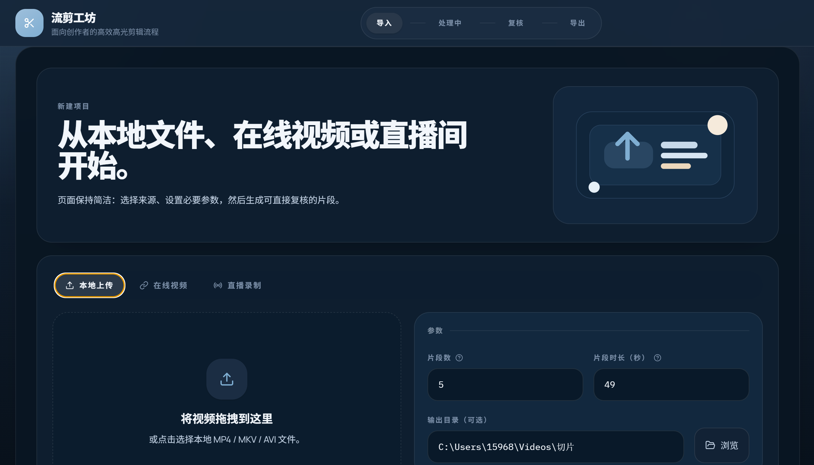
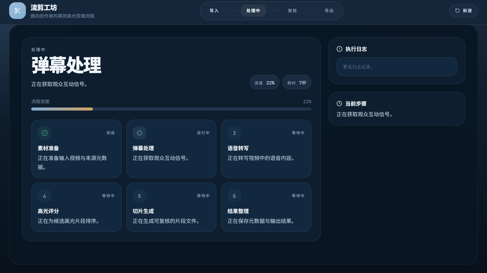
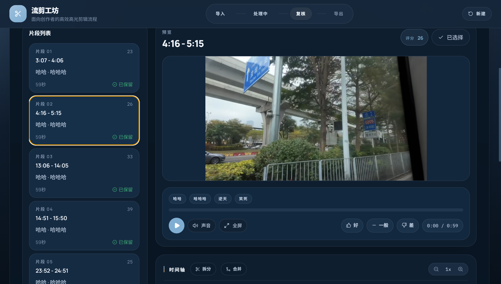
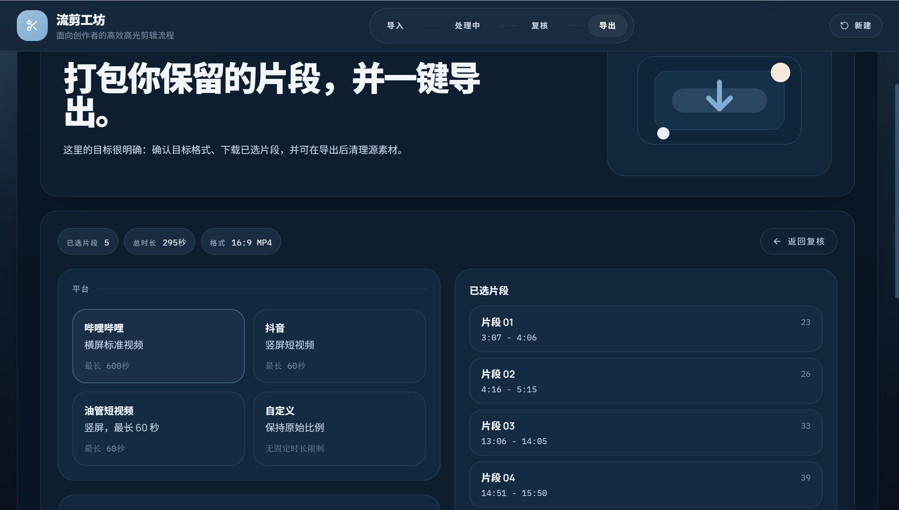

<div align="center">

# Stream Clipper

**Turn hours of livestream footage into minutes of highlights.**

Paste a link or drop a video → auto-detect highlight moments → review each clip → export

[Quick Start](#quick-start) · [Desktop App](#desktop-app) · [How It Works](#how-it-works) · [Contributing](#contributing)

</div>

---

## The Problem

If you clip livestreams, you already know: the hardest part isn't editing — it's **scrubbing through hours of footage to find the moments worth clipping**.

Stream Clipper automates that. It analyzes chat activity and speech to pinpoint highlights, cuts the clips for you, and lets you review them before exporting.

## Screenshots

<table>
<tr>
<td width="50%">

**Import** — Local files, Bilibili/YouTube links, or live recording



</td>
<td width="50%">

**Processing** — 6-step automated pipeline with live progress



</td>
</tr>
<tr>
<td width="50%">

**Review** — Preview each clip, rate it, adjust the timeline



</td>
<td width="50%">

**Export** — Pick a target platform format, batch export



</td>
</tr>
</table>

## How It Works

Three signals are combined to locate highlight moments:

| Signal | What it measures |
|--------|-----------------|
| **Chat density** | Sudden spikes in chat/danmaku activity |
| **Emotion keywords** | Concentration of excitement words in chat |
| **Speech–chat overlap** | When what the streamer says matches what chat is saying (ASR + CJK Jaccard similarity) |

Weighted sum → Gaussian smoothing → peak detection → auto-clip.

## Features

- **Multi-source input** — Local video, Bilibili VOD, YouTube, Douyin, live stream recording
- **Local ASR** — faster-whisper runs entirely on your machine, no cloud API needed
- **Highlight scoring** — Chat density + emotion keywords + speech overlap, fused into a single score
- **Review workflow** — Video preview, rating (good / ok / bad), timeline split & merge
- **Platform-aware export** — Bilibili landscape / Douyin vertical / YouTube Shorts / custom aspect ratio
- **Feedback learning** — Your ratings are logged; train a lightweight ranker to improve recommendations over time

## Quick Start

### Requirements

- Python 3.11+
- Node.js 18+
- FFmpeg (must be in PATH)

### Install & Run

```bash
git clone https://github.com/Cbhhhh211/livestream-highlight-clipper.git
cd Stream-Clipper-Factory

# Install Python dependencies
pip install -r requirements.txt

# Build frontend
cd frontend && npm install && npm run build && cd ..

# Start (runs API + frontend together)
python app.py
```

Open `http://127.0.0.1:5173` in your browser.

### Docker

```bash
docker compose up
```

With GPU acceleration (CUDA):

```bash
docker compose -f docker-compose.yml build --build-arg DOCKERFILE=Dockerfile.gpu
```

## Desktop App

Don't want to set up a dev environment? Download the standalone desktop app:

👉 [Download from Releases](https://github.com/Cbhhhh211/livestream-highlight-clipper/releases)

- Windows 10/11 x64
- Bundled Python runtime + FFmpeg — nothing else to install

## Project Structure

```
├── frontend/          React frontend (Vite + Tailwind)
├── services/          FastAPI service layer (routes, worker, queue)
├── stream_clipper/    Core algorithms (ASR, chat analysis, scoring, clipping)
├── tools/             Training & evaluation scripts
├── tests/             Test suite
└── app.py             One-command launcher
```

## Feedback Training

Ratings you give during review (good / ok / bad) are automatically saved:

```
output/_api_jobs/_feedback/clip_feedback.jsonl
```

Once you have enough data, train the ranker:

```bash
python tools/train_feedback_ranker.py
```

The model learns your preferences and improves future recommendations.

## Tech Stack

| Layer | Technology |
|-------|-----------|
| Frontend | React · Vite · Tailwind CSS · Zustand |
| Backend | FastAPI · uvicorn |
| ASR | faster-whisper |
| Video | FFmpeg · ffmpeg-python · yt-dlp |
| Signal processing | NumPy · SciPy (Gaussian smoothing + peak detection) |
| Chat/Danmaku | WebSocket live collection (Bilibili protocol) · XML parsing |

## Contributing

- Found a bug or have a suggestion? [Open an Issue](https://github.com/Cbhhhh211/livestream-highlight-clipper/issues)
- Want to contribute? Fork → change → PR

## License

[MIT](LICENSE)
